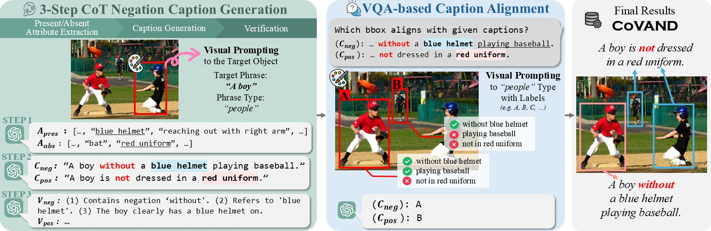
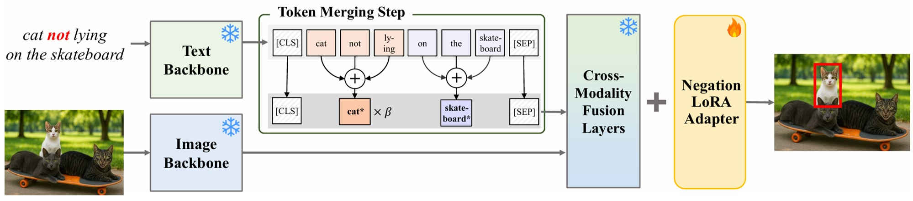

# [ICLR 2026] What "Not" to Detect: Negation-Aware VLMs via Structured Reasoning and Token Merging
Identifies the affirmative bias of VLMs when processing negation and improves detection accuracy with a negation token-merging module and a reasoning-aware data pipeline.

### ⭐ Link to Paper: [Link](https://arxiv.org/abs/2510.13232)
### 📚 Link to Dataset (CoVAND): [Link](https://huggingface.co/datasets/2na-97/CoVAND)

-----
### CoVAND Dataset

  
   
  <em>Dataset Generation Pipeline of the COVAND. Our method first generates negation-focused captions for visually prompted regions using a three-step CoT process, then aligns each caption with the correct bounding box via VQA-based reasoning to ensure semantic correspondence.</em>

### NegToMe Training Pipeline

  
   
  <em>The input image and captions of CoVAND are encoded by frozen backbones. NegToMe assigns higher importance to negation cues in the text, and the LoRA adapter enables accurate localization of objects described by negated queries.</em>

